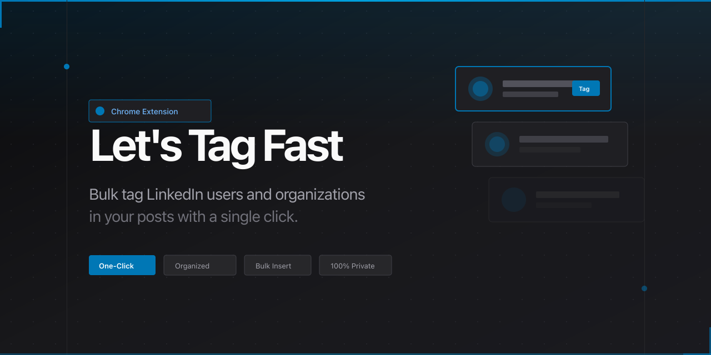

<h1 align="center">Let's Tag Fast</h1>

[](https://nextjs.org/)
[](https://typescriptlang.org/)
[](https://tailwindcss.com/)
[](https://bun.sh/)

<p align="center">
  Bulk tag LinkedIn users in seconds
  <br />
  <br />
  <a href="https://letstag.fast">Website</a>
  ·
  <a href="https://github.com/crafter-station/linkedin-tag-extension/issues">Issues</a>
  ·
  <a href="https://crafters.chat">Community</a>
</p>

## Setup

```bash
bun install
bun dev
```


## Tech

- Next.js 15
- Tailwind CSS
- Jost + Geist fonts
